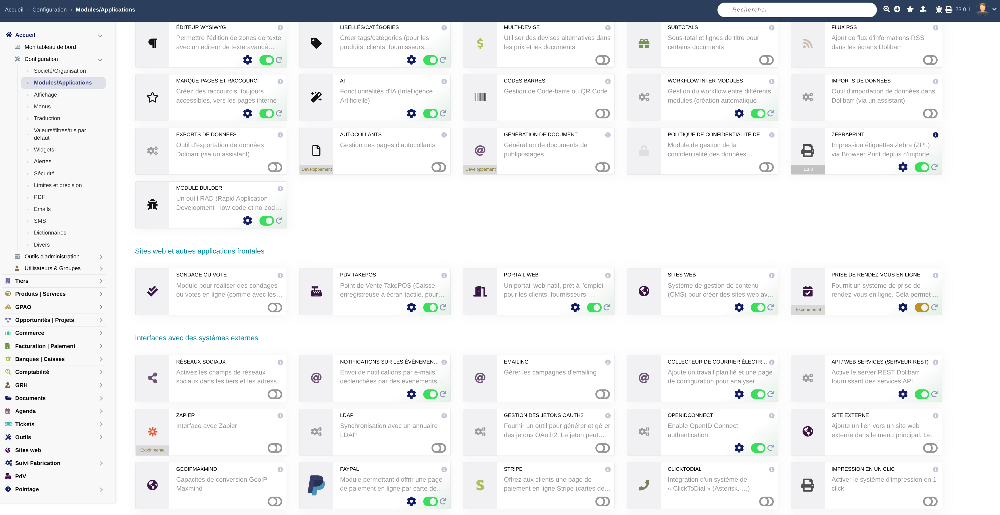

# FullSidebar — complete left sidebar for Dolibarr



Replaces Dolibarr's **contextual** left menu with a **collapsible tree listing every
module and all of its submenus**, reachable from any page.

The top menu, the mobile drawer (`menuhider`), the theme and existing hooks are left
untouched: only the rendering of the left menu is replaced.

*Version française : [README.fr.md](README.fr.md)*

| | |
|---|---|
| **Dolibarr** | 23.0 and later (only version tested) |
| **PHP** | 7.3 and later |
| **Theme** | eldy |
| **License** | GPL v3 or later ([COPYING](COPYING)) |

---

## Installation

1. Copy the folder to `htdocs/custom/fullsidebar/` (permissions `644` for files, `755`
   for folders). The folder must be named **`fullsidebar`**: rename the one produced by
   GitHub's zip (`dolibarr-fullsidebar-main`), or clone straight to the right name:

   ```
   git clone https://github.com/Thibault-mns/dolibarr-fullsidebar.git htdocs/custom/fullsidebar
   ```
2. **Home → Setup → Modules/Applications → Interfaces tab**: enable
   "Full sidebar menu".
   Enabling the module sets `MAIN_MENU_STANDARD = 'fullsidebar_menu.php'` itself and
   remembers the previous handler in `FULLSIDEBAR_PREVIOUS_MENU`.
3. Reload any page: the complete sidebar shows up.

Disabling the module restores the previous menu handler automatically.

The complete sidebar applies to **internal users**. External users (portal) use the
handler set in `MAIN_MENUFRONT_STANDARD`, which the module does not change: they keep
the eldy menu.

To go back to the stock menu without disabling the module, set "Enable the full
sidebar" to *No* in the setup page.

---

## How it works

`main.inc.php` loads the handler named by `MAIN_MENU_STANDARD` by looking in:

```php
$dirmenus = array_merge(array("/core/menus/"), (array) $conf->modules_parts['menus']);
foreach ($dirmenus as $dirmenu) {
    $menufound = dol_include_once($dirmenu."standard/".$file_menu);
```

The descriptor declares `module_parts['menus'] = 1`, which adds
`/fullsidebar/core/menus/` to that list. **No core file is modified** and the handler
survives Dolibarr upgrades.

If the handler cannot be found (module disabled), `main.inc.php` falls back to
`eldy_menu.php` on its own and writes a warning to the syslog — never a blank page.

### Building the tree

The "all modules" left menu reuses the core instead of rewriting it:

| Step | Call |
|------|------|
| First level entries (the modules) | `print_eldy_menu(..., $noout = 1, 'jmobile')` — `jmobile` mode skips the "hamburger" entry |
| Full submenu of one module | `print_left_eldy_menu(..., $noout = 1, $mainmenu, 'all')` |
| Entries coming from `llx_menu` | `Menubase::menuLoad($mainmenu, 'all', ...)` |

Two points matter:

- `menuLoad()` with `leftmenu = 'all'` rewrites every `$leftmenu == 'x'` condition to
  `1==1`. This is what unlocks the submenus of the modules **you are not browsing**.
- `print_left_eldy_menu()` with a non-empty `$forceleftmenu` sets its internal
  `$leftmenu` to `''`. Every hardcoded branch of `eldy.lib.php` is guarded by
  `$usemenuhider || empty($leftmenu) || $leftmenu == "x"`, so all of them are added.

The rendering itself is fully rewritten (`<ul>`/`<li>` + expand buttons). This is the
trap of `auguria_menu.php`: it does load `leftmenu='all'`, but it renders jQuery Mobile
markup that **does not display** outside the Auguria theme — empty sidebar, no error.

### Two details the core drops with `$noout = 1`

`print_left_eldy_menu()` runs the `menuLeftMenuItems` hook and the `positionfull` sort
on its **local copy**, which it throws away when `$noout = 1`. Both are replayed here
(`buildBranch()`); otherwise entries added by third party modules and the declared order
would be lost. Accepted consequence: the hook runs twice per main menu — it is expected
to be a pure array transformation, as in the core.

### Cross-module navigation, and the `&amp;` trap

`eldy` submenu urls often only carry `leftmenu=...`. Clicking "Third parties → List"
from the home page would then leave `$_SESSION['mainmenu']` on `home`. `buildHref()`
therefore forces the `mainmenu` of the root module when the url carries none — the whole
point of a complete sidebar.

`eldy.lib.php` also mixes `&` and `&amp;` separators in its urls (for instance the
invoice filter entries). The stock renderer prints the `href` **unescaped**, so `&amp;`
stays valid. Here the attribute is escaped (safer), which turned `&amp;` into
`&amp;amp;`: the browser then read a parameter literally named `amp;search_status` and
**the filter was not applied**. `buildHref()` normalises separators to `&` before
building the link, and the single escaping done at print time yields a correct `href`.

### What is expanded on load

Only the **current module** and the **path leading to the displayed page**
(`markPaths()`). Expanding the whole branch of the current module — what eldy's flat
menu does — drowns the tree: every sibling group ends up open.

On a card page (`/compta/facture/card.php?id=12`) no menu url matches; the session
`leftmenu` (`customers_bills`) is then used as a fallback to open the right group.

---

## Configuration

**Home → Setup → Modules → Full sidebar menu → gear icon**

| Constant | Default | Purpose |
|----------|---------|---------|
| `MAIN_MENU_STANDARD` | `fullsidebar_menu.php` | Active handler (set on activation) |
| `FULLSIDEBAR_HIDE_TOPMENU` | `0` | Hides the top menu entries (bar, logo and hamburger stay) |
| `FULLSIDEBAR_EXPAND_ALL` | `0` | Expand everything on load instead of the current path only |
| `FULLSIDEBAR_REMEMBER_OPENED` | `1` | Remembers opened branches (localStorage, per browser, per user and per instance) |
| `FULLSIDEBAR_SHOW_UNAUTHORIZED` | `0` | Shows unauthorised entries greyed out instead of hiding them |
| `FULLSIDEBAR_PREVIOUS_MENU` | — | Handler restored when the module is disabled |

### Top bar

Hiding the top menu entries empties the bar. The setup page therefore mirrors three
**native Dolibarr options** that fill it (read by `top_menu()` in `main.inc.php`):

| Constant | Effect |
|----------|--------|
| `MAIN_USE_TOP_MENU_SEARCH_DROPDOWN` | Global search in the top bar |
| `MAIN_USE_TOP_MENU_QUICKADD_DROPDOWN` | "+" quick creation button |
| `MAIN_USE_TOP_MENU_IMPORT_FILE` | File upload link (no native setup screen) |

The first one is recommended: `left_menu()` only builds the search form **when it is
off**. Turning it on frees the top of the sidebar — where the form competes with the
tree — and fills the top bar. Bookmarks (`top_menu_bookmark()`) are already there by
default.

These three constants belong to the core (Setup → Display) and are **deliberately
absent from `$this->const`**: `insert_const()` can never force a module value into them
on reactivation, and `remove()` leaves them alone. `MAIN_USE_TOP_MENU_IMPORT_FILE`
accepts a custom upload url instead of `1`; the setup keeps such a value instead of
overwriting it.

> `FULLSIDEBAR_SHOW_UNAUTHORIZED` defaults to `0`, unlike the core behaviour
> (`MAIN_MENU_HIDE_UNAUTHORIZED` unset ⇒ everything shown greyed out). With a tree of
> **every** module, that default would make the sidebar unreadable.

---

## Caveats / limits

- **`module_parts` are read at ACTIVATION.** Any change to `module_parts` (menus, css,
  js) in the descriptor requires a **disable / enable** cycle. The setup page shows a
  warning when `$conf->modules_parts['menus']['fullsidebar']` is missing.
- **`MAIN_MENU_INVERT`** (swapped horizontal/vertical menus) is not supported: a tree of
  every module cannot be laid out horizontally. The stock `eldy` menu is rendered
  instead.
- **Theme**: tested against `eldy`. Colours come from design system tokens (`--accent`,
  `--ink`, `--muted`, `--line`, `--surface`, `--radius-element`, `--font-family`) when
  the theme exposes them, otherwise from Dolibarr's CSS variables (which already switch
  in dark mode), otherwise from a hardcoded value. Layout rules (sticky column, wider
  mobile drawer) only apply on pages where the tree is rendered.
- **Cost**: loading the menus makes 2 queries on `llx_menu` instead of one (a "current
  context" pass and an `all` pass). The second one is **lazy**: it only runs when the
  tree is built. This matters because `loadMenu()` is also called by
  `theme/*/style.css.php` (for `$nbtopmenuentries`), and that stylesheet is
  render-blocking. When the Accountancy module is enabled,
  `get_left_menu_accountancy()` adds its 2 dictionary queries on every page instead of
  accountancy pages only.
- **Measuring the real cost**: for an administrator, an HTML comment right after the
  tree (page source) gives the number of entries, the build and print times, and the
  size of the tree HTML.
- **`menuLeftMenuItems` hook**: it runs twice per module and per page (once by the core,
  once replayed by the module). A third party module running queries in that hook pays
  them twice.
- **Width**: `.vmenu` is 240 px wide in `eldy`. The tree adapts to it (`width:100%`,
  long labels wrap) but does not widen it — that would require changing the theme.

---

## Files

```
fullsidebar/
├── core/modules/modFullSidebar.class.php        descriptor (module_parts, const, init/remove)
├── core/menus/standard/fullsidebar_menu.php     MenuManager class (loading + rendering)
├── admin/setup.php                              setup page
├── css/fullsidebar.css                          tree styles
├── js/fullsidebar.js                            expand/collapse + remembering
├── langs/{fr_FR,en_US}/fullsidebar.lang         labels
└── test/tree_test.php                           standalone tests (CLI, no database)
```

## Tests

```
php htdocs/custom/fullsidebar/test/tree_test.php
```

Dolibarr helpers are stubbed: the suite runs without a database or `conf.php` and covers
nesting (levels → tree, level jumps, forbidden parents), link building (forced
`mainmenu`, `&amp;` normalisation), the expansion rule (active path only, fallback on the
session `leftmenu`) and key uniqueness. It does **not** test Dolibarr's menu API itself —
only a real install does.

License GPL v3 or later, see [COPYING](COPYING).
